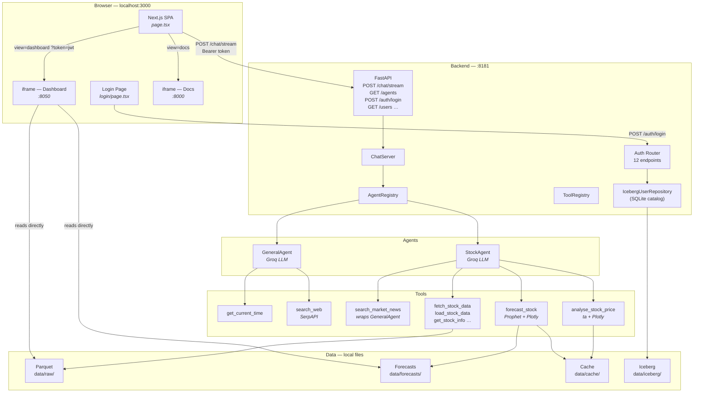
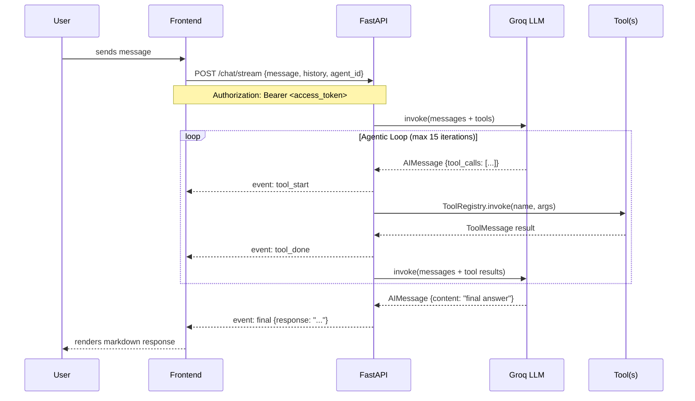
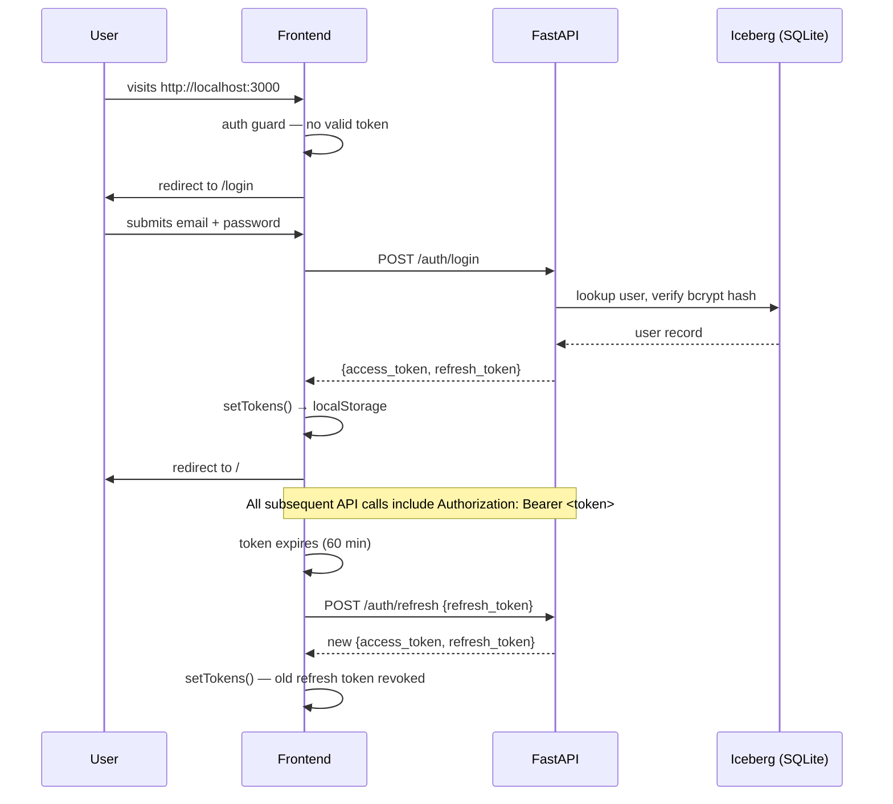
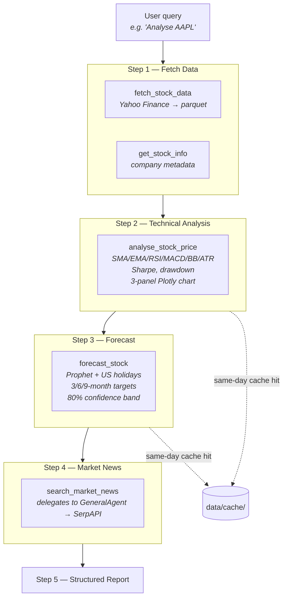

# AI Agent UI

A fullstack agentic chat application powered by LangChain, FastAPI, and Next.js. The backend runs an LLM in a tool-calling loop; the frontend is a single-page app that embeds the Docs and Dashboard in-context alongside the chat interface. JWT authentication and role-based access control protect all three surfaces.

---

## Services at a Glance

| Service | Stack | Port | Purpose |
|---------|-------|------|---------|
| **Frontend** | Next.js 16 + React 19 + Tailwind 4 | `3000` | Chat UI + SPA shell (login, chat, docs, dashboard, admin) |
| **Backend** | FastAPI + LangChain + Groq | `8181` | Agentic loop + REST API + Auth endpoints |
| **Dashboard** | Plotly Dash + Dash Bootstrap (FLATLY) | `8050` | Stock analysis dashboard + Admin UI |
| **Docs** | MkDocs Material | `8000` | Project documentation |

---

## Quick Start

```bash
# 1. Create backend/.env with your keys and JWT secret
cat > backend/.env <<EOF
GROQ_API_KEY=gsk_...
JWT_SECRET_KEY=$(python -c "import secrets; print(secrets.token_hex(32))")
ADMIN_EMAIL=admin@example.com
ADMIN_PASSWORD=Admin1234
SERPAPI_API_KEY=abc123...   # optional — needed for web search
EOF

# 2. Create the frontend env file
cp frontend/.env.local.example frontend/.env.local

# 3. Start everything
#    On first run: Iceberg tables are created and superuser is seeded automatically
./run.sh start

# 4. Log in and open the chat
open http://localhost:3000/login
```

Stop all services: `./run.sh stop` · Status: `./run.sh status`

---

## System Architecture



---

## Agentic Loop

Every message goes through an LLM-driven tool-calling loop before a response is returned, streamed live to the browser via NDJSON.



---

## Auth Flow



---

## Stock Analysis Pipeline



---

## Frontend SPA

The entire UI is one mounted React component. The `view` state switches between chat, docs, dashboard, and admin without unmounting — chat history is always preserved.

```
┌──────────────────────────────────────────────────────────────┐
│  ✦ AI Agent  [General | Stock Analysis]  [Sign out]  [🗑]    │ ← header
│           (breadcrumb label when view ≠ chat)                │
├──────────────────────────────────────────────────────────────┤
│                                                              │
│  view = "chat"            │  view = "docs" / "dashboard"    │
│  ─────────────────────    │    / "admin"                    │
│  scrollable messages      │  <iframe src={iframeUrl ??      │
│  + StatusBadge (stream)   │    baseServiceUrl}?token=jwt>   │
│  + input textarea         │                                  │
│                                                              │
└──────────────────────────────────────────────────────────────┘
                                              [⊞] ← FAB (bottom-right)
                                         Chat / Docs / Dashboard / Admin
```

---

## Project Structure

```
ai-agent-ui/
├── run.sh                    # Unified launcher (start/stop/status/restart)
├── README.md
├── CLAUDE.md                 # Claude Code project context
├── PROGRESS.md               # Session log
│
├── auth/                     # Auth package (project root — importable by backend + scripts)
│   ├── __init__.py
│   ├── create_tables.py      # One-time Iceberg table init (idempotent)
│   ├── repository.py         # IcebergUserRepository — CRUD + audit log
│   ├── service.py            # AuthService — bcrypt + JWT lifecycle + deny-list
│   ├── models.py             # Pydantic request/response models
│   ├── dependencies.py       # FastAPI dependency functions
│   └── api.py                # create_auth_router() — 12 endpoints
│
├── scripts/
│   └── seed_admin.py         # Bootstrap first superuser from env vars
│
├── frontend/                 # Next.js 16
│   ├── app/
│   │   ├── page.tsx          # Entire SPA (chat + docs + dashboard + admin views)
│   │   ├── login/
│   │   │   └── page.tsx      # Login page
│   │   ├── layout.tsx
│   │   └── globals.css
│   ├── lib/
│   │   ├── auth.ts           # JWT token helpers
│   │   └── apiFetch.ts       # Authenticated fetch wrapper (auto-refresh)
│   ├── .env.local            # Gitignored — copy from .env.local.example
│   └── .env.local.example    # Committed reference
│
├── backend/                  # FastAPI
│   ├── main.py               # ChatServer, routes, auth router mount
│   ├── config.py             # Pydantic Settings (.env support)
│   ├── logging_config.py     # Rotating file + console logging
│   ├── agents/
│   │   ├── base.py           # BaseAgent ABC + agentic loop + stream()
│   │   ├── registry.py       # AgentRegistry
│   │   ├── general_agent.py  # GeneralAgent (Groq)
│   │   └── stock_agent.py    # StockAgent (Groq)
│   └── tools/
│       ├── registry.py       # ToolRegistry
│       ├── time_tool.py      # get_current_time
│       ├── search_tool.py    # search_web (SerpAPI)
│       ├── agent_tool.py     # search_market_news (wraps GeneralAgent)
│       ├── stock_data_tool.py      # 6 Yahoo Finance tools
│       ├── price_analysis_tool.py  # analyse_stock_price
│       └── forecasting_tool.py     # forecast_stock (Prophet)
│
├── dashboard/                # Plotly Dash (FLATLY light theme)
│   ├── app.py                # Entry point, routing, auth store, dotenv loader
│   ├── layouts.py            # Page layout factories + NAVBAR
│   ├── callbacks.py          # All interactive callbacks + auth guards + admin UI
│   └── assets/custom.css     # Light theme styles
│
├── data/
│   ├── raw/                  # OHLCV parquet (gitignored)
│   ├── forecasts/            # Prophet output parquet (gitignored)
│   ├── cache/                # Same-day text cache (gitignored)
│   ├── iceberg/              # Iceberg catalog + warehouse (gitignored)
│   └── metadata/             # Stock registry + company info (tracked)
│
├── charts/                   # Generated Plotly HTML (gitignored)
├── docs/                     # MkDocs source
└── mkdocs.yml
```

---

## Tech Stack

### Frontend
| Package | Version | Role |
|---------|---------|------|
| Next.js | 16 | Framework |
| React | 19 | UI |
| Tailwind CSS | 4 | Styling |
| react-markdown + remark-gfm | 10 / 4 | Markdown rendering |
| TypeScript | 5 | Type safety |

### Backend
| Package | Role |
|---------|------|
| FastAPI + uvicorn | HTTP server |
| LangChain | Agentic loop + tool binding |
| langchain-groq | Groq LLM provider |
| Pydantic v2 + pydantic-settings | Request/response models + settings |
| yfinance | Yahoo Finance OHLCV data |
| Prophet | Time-series forecasting |
| ta | Technical analysis indicators |
| Plotly | Interactive HTML charts |
| pyarrow | Parquet read/write |
| pandas / numpy | Data manipulation |

### Dashboard
| Package | Role |
|---------|------|
| Dash 4 | Web framework |
| dash-bootstrap-components (FLATLY) | Light Bootstrap theme |
| Plotly | Charts |

### Auth
| Package | Role |
|---------|------|
| python-jose | JWT (HS256) signing and verification |
| passlib + bcrypt 4 | Password hashing (bcrypt cost 12) |
| pyiceberg[sql-sqlite] | Apache Iceberg storage (SQLite catalog) |
| python-multipart | OAuth2 form endpoint support |
| email-validator | `EmailStr` field validation |

---

## Environment Variables

All backend variables live in `backend/.env` (gitignored).

| Variable | Required | Default | Description |
|----------|----------|---------|-------------|
| `GROQ_API_KEY` | Yes | — | Groq LLM API key |
| `JWT_SECRET_KEY` | Yes | — | JWT signing secret — min 32 random chars |
| `ADMIN_EMAIL` | First run | — | Superuser email for seed script |
| `ADMIN_PASSWORD` | First run | — | Superuser password (min 8 chars, 1 digit) |
| `SERPAPI_API_KEY` | No | — | Web search — `search_web` returns error without it |
| `ACCESS_TOKEN_EXPIRE_MINUTES` | No | `60` | JWT access token TTL |
| `REFRESH_TOKEN_EXPIRE_DAYS` | No | `7` | JWT refresh token TTL |
| `LOG_LEVEL` | No | `DEBUG` | Minimum log severity |
| `LOG_TO_FILE` | No | `true` | Write logs to `backend/logs/agent.log` |
| `NEXT_PUBLIC_BACKEND_URL` | No | `http://127.0.0.1:8181` | `frontend/.env.local` |
| `NEXT_PUBLIC_DASHBOARD_URL` | No | `http://127.0.0.1:8050` | `frontend/.env.local` |
| `NEXT_PUBLIC_DOCS_URL` | No | `http://127.0.0.1:8000` | `frontend/.env.local` |

---

## Extending the App

### Add a new tool

1. Create `backend/tools/my_tool.py` with a `@tool`-decorated function.
2. Register it in `ChatServer._register_tools()` in `main.py`.
3. Add the tool name to the relevant agent's `tool_names` list.

### Add a new agent

1. Subclass `BaseAgent` in `backend/agents/my_agent.py` — only implement `_build_llm()`.
2. Register it in `ChatServer._register_agents()`.
3. Add the agent ID to the `AGENTS` array in `frontend/app/page.tsx`.

### Switch to Claude Sonnet 4.6

Two-line change in `agents/general_agent.py` and `agents/stock_agent.py`:

```python
# Change import
from langchain_anthropic import ChatAnthropic

# Change return in _build_llm()
return ChatAnthropic(model="claude-sonnet-4-6", temperature=self.config.temperature)
```

Also set `ANTHROPIC_API_KEY` in `backend/.env` instead of `GROQ_API_KEY`.

---

## Known Limitations

| Issue | Notes |
|-------|-------|
| **Groq LLM** | Claude Sonnet 4.6 is the intended model; Groq is a temporary workaround |
| **`SERPAPI_API_KEY` required for web search** | Free tier (100/month) at serpapi.com |
| **Refresh token deny-list is in-memory** | Cleared on backend restart — revoked tokens become valid again until natural expiry (7 days) |
